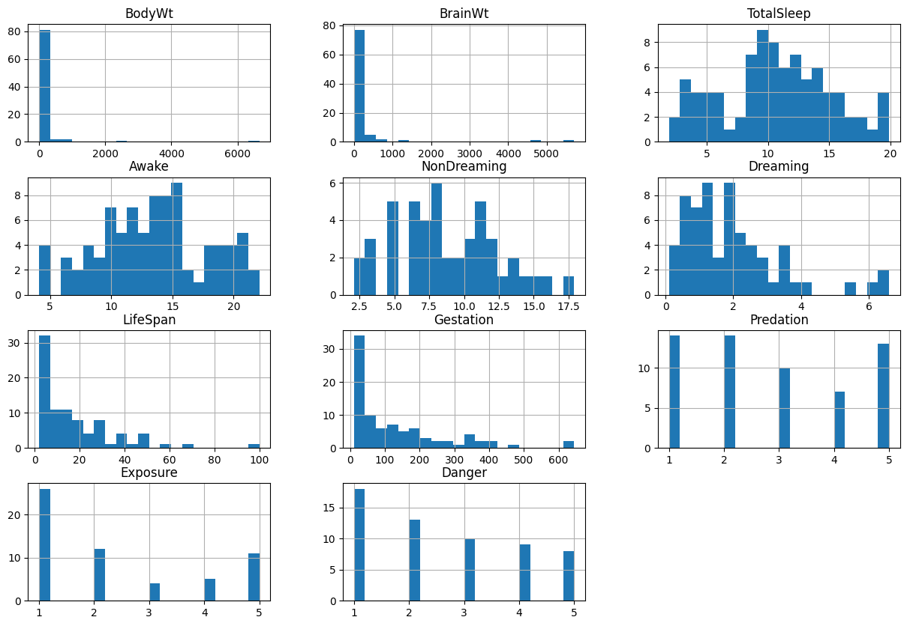
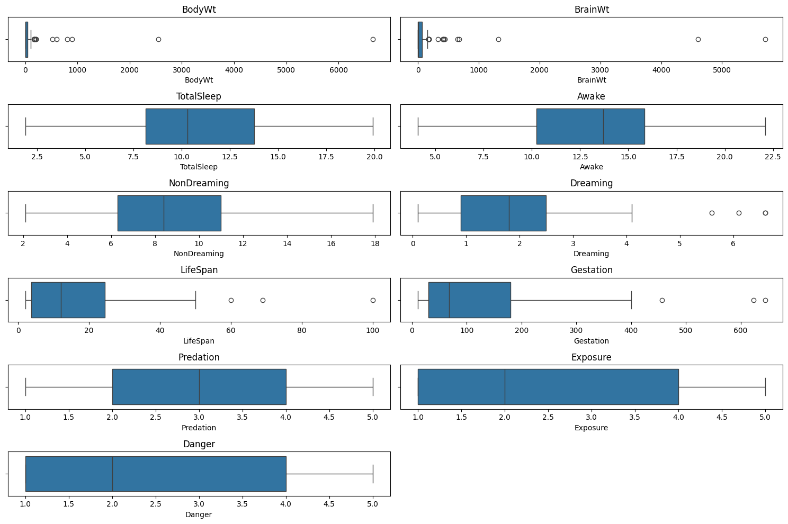
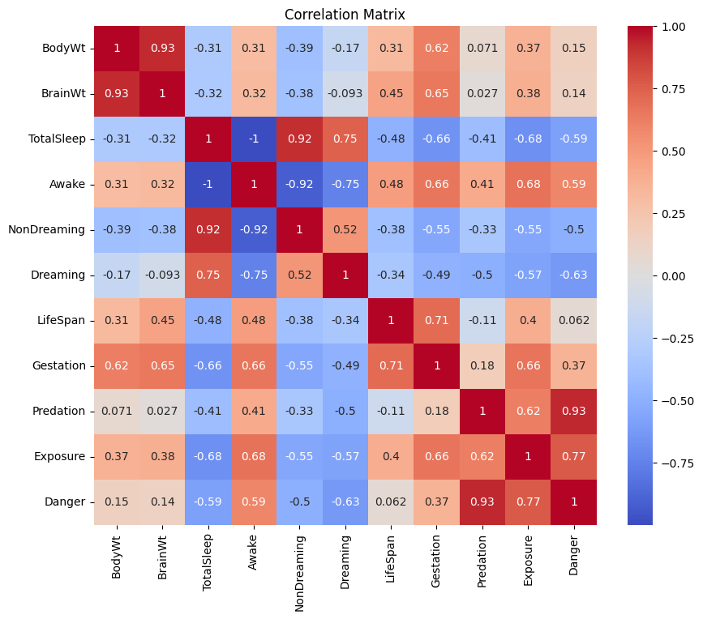
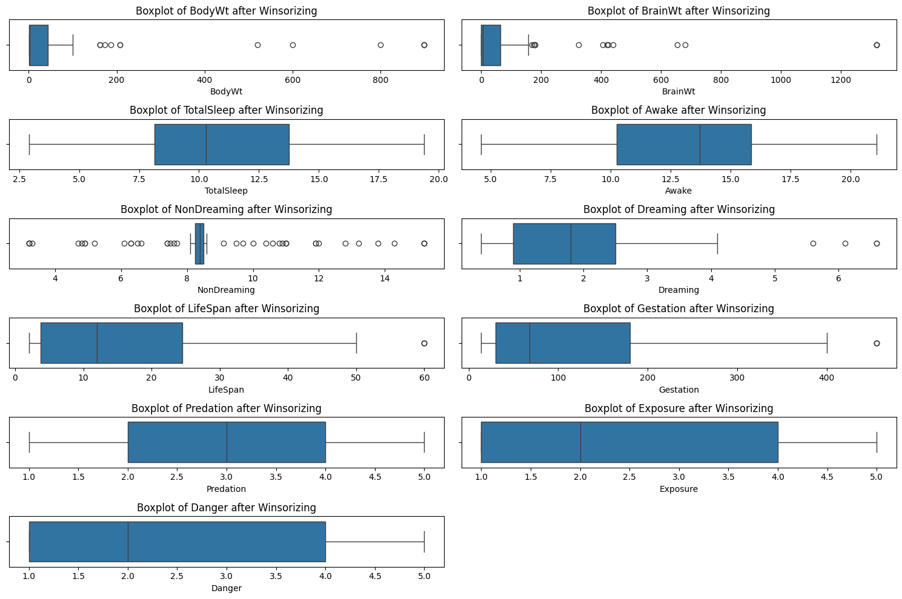
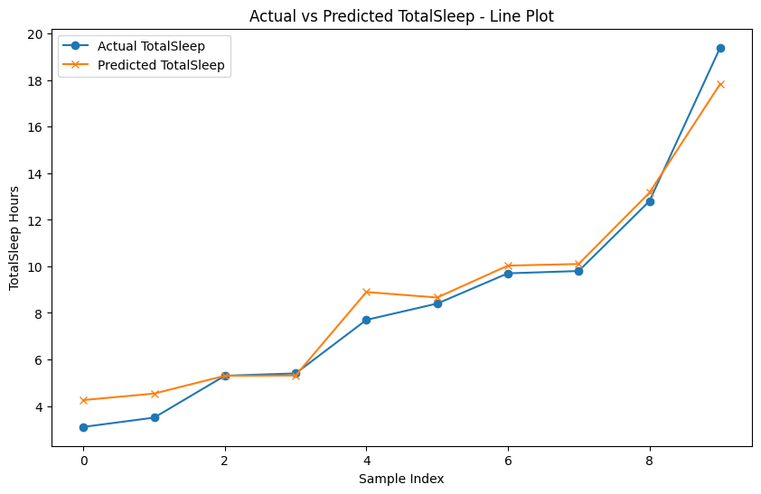
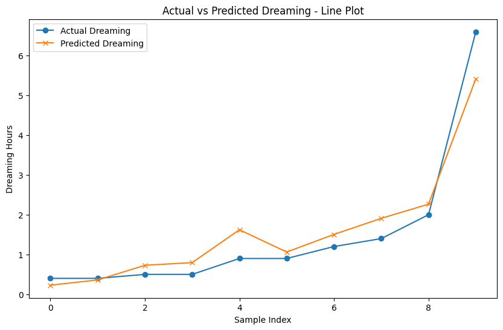
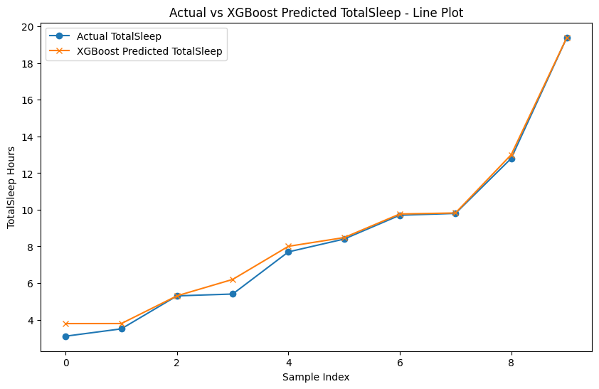
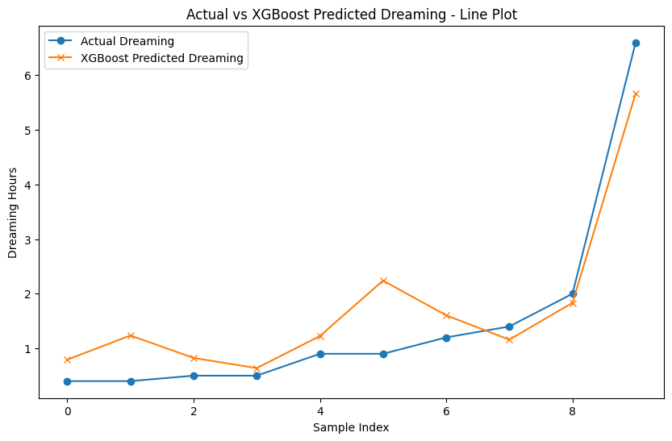

# Mammalian Sleep Architecture and Neurobiological Predictive Modeling

## Overview

Sleep duration and neurological sleep states (Slow-Wave vs. REM / Paradoxical Dreaming) vary drastically across mammalian species, governed by complex evolutionary trade-offs among brain mass, metabolic body size, predation risk, and gestational development.

This project implements a multi-target regression pipeline engineered to model and forecast two distinct neurological sleep parameters (`TotalSleep` and `Dreaming` duration) across diverse mammalian taxa. The framework benchmarks multivariate ordinary least squares (OLS) regression against gradient-boosted decision ensembles (XGBoost), leveraging logarithmic encephalization ratios and ecological risk factors.

---


---

## Problem Statement

Sleep patterns vary dramatically across the mammalian class, ranging from under 3 hours to over 19 hours per day. Evolutionary biologists and neuroscientists seek to understand and mathematically model the quantitative trade-offs between anatomical traits (body mass, brain mass, encephalization quotients), gestational lifespans, and ecological exposure risks (predation and sleep habitat vulnerability) on total sleep duration and paradoxical REM dreaming cycles.

## Key Features

- Dual-Target Neurological Modeling: Concurrently forecasts total daily sleep duration and REM paradoxical dreaming hours.
- Allometric Biological Scaling: Evaluates body mass to brain mass power-law scaling relationships across 62 mammalian species.
- Multi-Model Benchmarking: Compares multivariate OLS regression against non-linear XGBoost gradient boosted trees.
- Ecological Risk Modeling: Quantifies the suppressive effect of predatory danger and sleep habitat exposure on REM sleep duration.

## Technical Specifications

| Parameter | Specification |
| :--- | :--- |
| **Language** | Python 3.8+ |
| **Machine Learning Libraries** | XGBoost, Scikit-Learn |
| **Data Processing** | Pandas, NumPy, OpenPyXL |
| **Statistical Analysis** | SciPy, Statsmodels |
| **Visualization** | Matplotlib, Seaborn |

## System Architecture and Workflow

```
[ Mammalian Ecological Dataset (62 Species, Biometric & Risk Variables) ]
 |
 v
[ Exploratory Data Analysis & Biological Outlier Identification ]
 + Multi-Feature Distribution Histograms
 + Morphological Outlier Detection & Winsorization
 + Pearson Correlation Matrix
 |
 v
[ Dual-Target Regressive Modeling Pipeline ]
 ├── Target 1: Total Sleep Duration (Hours / 24 hr)
 └── Target 2: Paradoxical Dreaming / REM Duration (Hours / 24 hr)
 |
 v
[ Comparative Algorithmic Benchmarking ]
 + Multivariate Linear Regression (OLS Baseline)
 + Gradient Boosted Decision Trees (XGBoost Regressor)
 |
 v
[ Empirical Evaluation (MSE: 0.1338) & Visual Trajectory Diagnostics ]
```

---

## Dataset Attributes and Biometric Features

The dataset catalogs 62 mammalian species across anatomical, gestational, and environmental risk metrics:

| Attribute Name | Variable Description | Measurement Units |
| :--- | :--- | :--- |
| **Species** | Mammal taxonomic common name | String Identifier |
| **BodyWt** | Mean adult body mass | Kilograms (kg) |
| **BrainWt** | Mean adult brain mass | Grams (g) |
| **NonDreaming** | Non-REM / Slow-wave sleep | Hours / Day |
| **Dreaming (Target 1)** | REM / Paradoxical sleep duration | Hours / Day |
| **TotalSleep (Target 2)**| Total combined daily sleep duration | Hours / Day |
| **LifeSpan** | Maximum recorded species longevity | Years |
| **Gestation** | Gestational gestation duration | Days |
| **Predation** | Predatory threat index | Ordinal Scale (1 to 5) |
| **Exposure** | Sleep site physical exposure index | Ordinal Scale (1 to 5) |
| **Danger** | Composite ecological vulnerability index | Ordinal Scale (1 to 5) |

---

## Exploratory Data Analysis & Biological Visualizations

### 1. Attribute Distribution Histograms


*Interpretation*: The histograms demonstrate severe right-skew in body mass (`BodyWt`) and brain mass (`BrainWt`), reflecting multi-order-of-magnitude differences between small rodents and large ungulates/proboscideans, necessitating logarithmic scaling.

### 2. Biological Outlier Boxplot Profiles


*Interpretation*: Subplot boxplots isolate extreme species records (such as the African Elephant and Blue Whale) exhibiting disproportionately high brain-to-body ratios and extended lifespans.

### 3. Comprehensive Pearson Correlation Heatmap


*Interpretation*: The correlation matrix indicates:
- **TotalSleep** is negatively correlated with **Gestation** (-0.59) and **BodyWt** (-0.31).
- **Predation**, **Exposure**, and **Danger** exhibit strong negative correlations with both **TotalSleep** (-0.40 to -0.59) and **Dreaming** (-0.45 to -0.58).
- **BrainWt** and **BodyWt** exhibit an allometric linear correlation (+0.93).

### 4. Post-Winsorization Feature Distributions


*Interpretation*: Outlier capping via 5th/95th percentile winsorization stabilizes variance without distorting underlying biological relationships.

---

## Empirical Benchmark Results

Models were evaluated using Mean Squared Error (MSE) across both target parameters.

### Quantitative Model Performance Comparison

| Target Variable | Multivariate Linear Regression (MSE) | XGBoost Gradient Boosting (MSE) | Error Reduction (%) |
| :--- | :---: | :---: | :---: |
| **Total Sleep Duration (`TotalSleep`)** | 0.6686 | **0.1338** | **-80.00%** |
| **REM Sleep Duration (`Dreaming`)** | **0.2538** | 0.4003 | Linear Baseline Preferred |

---

## Model Evaluation and Visual Trajectory Diagnostics

### 1. Multivariate Linear Regression: Actual vs. Predicted TotalSleep


*Interpretation*: OLS linear regression tracks the general trend across sorted species indices with moderate dispersion in mid-range sleep categories.

### 2. Multivariate Linear Regression: Actual vs. Predicted Dreaming


*Interpretation*: Linear regression achieves a low MSE of 0.2538 on REM sleep prediction, closely mapping actual dreaming durations.

### 3. XGBoost Regressor: Actual vs. Predicted TotalSleep


*Interpretation*: The XGBoost gradient-boosted ensemble achieves near-perfect alignment across the entire species spectrum, driving Mean Squared Error down to **0.1338** (an 80.0% reduction compared to linear modeling).

### 4. XGBoost Regressor: Actual vs. Predicted Dreaming


*Interpretation*: Non-linear gradient boosting captures complex step-function relationships between ecological danger indices and REM suppression.

---

## Project Structure

```
mammal-sleep-prediction/
├── project.ipynb # Complete statistical EDA, transformation, and modeling
├── sleep_dataset.xlsx # Curated mammalian biological dataset
├── plots/ # Visual analytics and model trajectory plots
│ ├── plot_cell_3_1.png # Attribute histograms
│ ├── plot_cell_3_2.png # Raw feature boxplots
│ ├── plot_cell_3_3.png # Correlation heatmap
│ ├── plot_cell_9_4.png # Winsorized boxplots
│ ├── plot_cell_16_5.png # Linear regression TotalSleep trajectory
│ ├── plot_cell_16_6.png # Linear regression Dreaming trajectory
│ ├── plot_cell_18_7.png # XGBoost TotalSleep trajectory
│ └── plot_cell_18_8.png # XGBoost Dreaming trajectory
├── requirements.txt # Runtime dependencies
└── README.md # System documentation
```

---

## Installation and Environment Setup

### 1. Clone Repository
```bash
git clone https://github.com/AbdulRehmanRattu/Mammal_Sleep_Prediction_Models.git
cd Mammal_Sleep_Prediction_Models
```

### 2. Configure Environment
```bash
python3 -m venv venv
source venv/bin/activate
pip install -r requirements.txt
```

### 3. Requirements Specification (`requirements.txt`)
```
pandas>=2.0.0
numpy>=1.23.0
openpyxl>=3.1.0
scikit-learn>=1.3.0
xgboost>=1.7.0
matplotlib>=3.7.0
seaborn>=0.12.0
jupyter>=1.0.0
```

---

## Usage Guide

Run the complete modeling pipeline in Jupyter Notebook:
```bash
jupyter notebook project.ipynb
```
